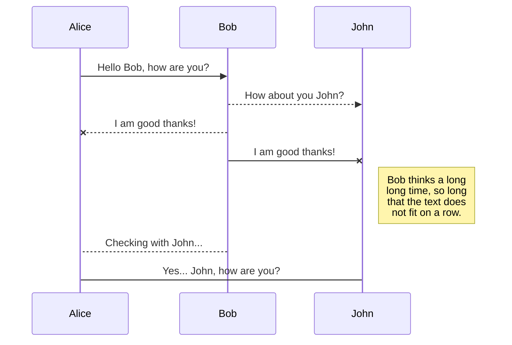
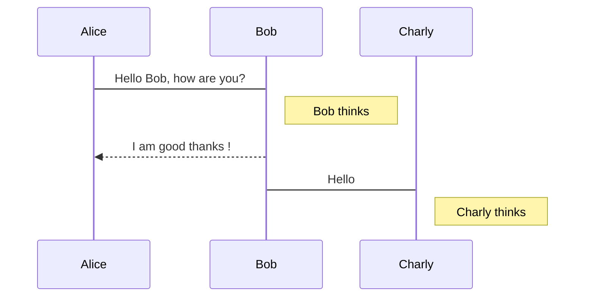
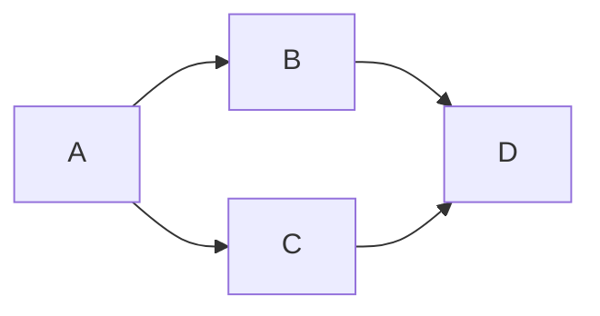

# Typora Example

## To-do List

- [x] task 1

- [ ] task 2
- [x] task 3

## Math Equations

$$
A = \frac{5}{3}
$$

## Code Blocks

### Python

```python
a = 0
for i in range(1:11):
	a += i
print(a)
```

### Verilog

```verilog
module top (
    input	[3:0]	a,
    input 	[3:0]	b,
    output 	[3:0]	c
);

assign c = a + b;

endmodule
```

## Block Diagram





## Here is a simple flow chart:




```geojson
{
  "type": "FeatureCollection",
  "features": [
    {
      "type": "Feature",
      "id": 1,
      "properties": {
        "ID": 0
      },
      "geometry": {
        "type": "Polygon",
        "coordinates": [
          [
              [-99.147717,19.503493],
              [-99.147243,19.503279],
              [-99.147467,19.502822],
              [-99.147946,19.503039],
              [-99.147717,19.503493]
          ]
        ]
      }
    }
  ]
}
```

  ```ditaa {cmd=true args=["-E"]}
  +--------+   +-------+    +-------+
  |        | --+ ditaa +--> |       |
  |  Text  |   +-------+    |diagram|
  |Document|   |!magic!|    |       |
  |     {d}|   |       |    |       |
  +---+----+   +-------+    +-------+
      :                         ^
      |       Lots of work      |

